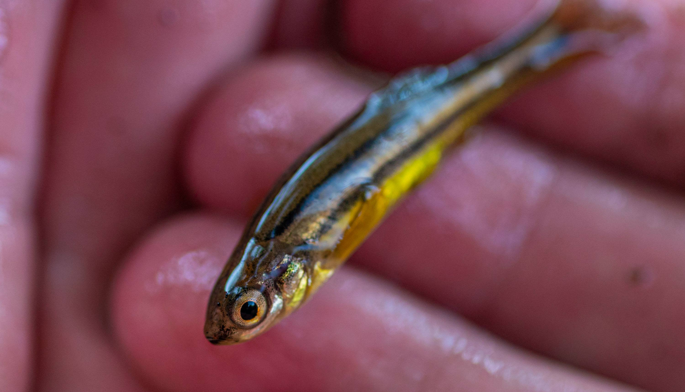

  
```{r setup, include=FALSE}
knitr::opts_chunk$set(echo = TRUE)
```


  


<br>
<br>
<br>


<p align="center">
<font size = "20"> Research </font> 
</p>


## {.tabset .tabset-fade .tabset-pills} 

### Summary

My research brings together elements of trophic and community ecology. 

### ![] 


<font size = 10> The Varied Role of Mesopredators in Lake Food Webs </p>


### ![]

- PhD Student (2019 to Present)

### Columbia University!

- M.A. Student in Ecology, Evolution, and Environmental Biology (2017 to 2019)

</p>


