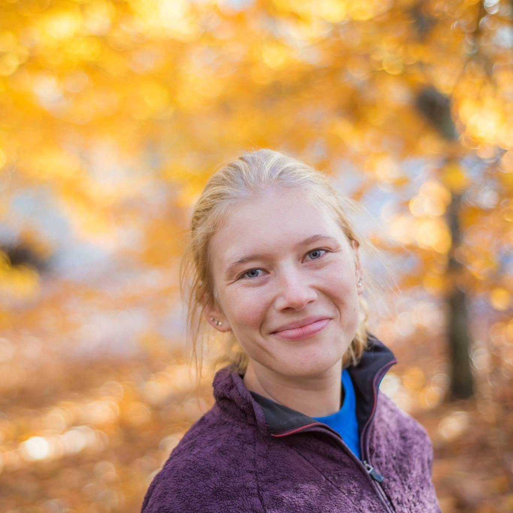

```{r setup, include=FALSE}
knitr::opts_chunk$set(echo = TRUE)
```
<br>
<br>
<center>I am a PhD student at Cornell University studying communities of Adirondack Minnows and their trophic dynamics.</center>
<br>
<br>
<br>

<center></center>